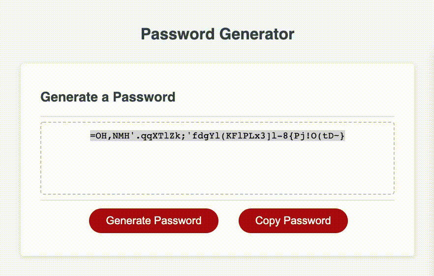

# password_generator

password generator using javascript to ask users for various criteria held in arrays.

Depending on the chosen password length and criteria, I used a for loop to randomly generate a string which is then added to the html page using another function.

Also, I have added a second button to the page that will allow users to copy the generated password to their clipboard.

Instructions:

1. click generate password
2. enter desired number of characters
3. choose if you would like to use uppercase/lowercase/numbers/special characters
4. click copy button to copy password to clipboard 

